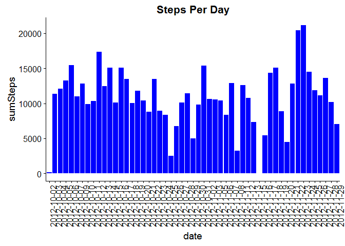
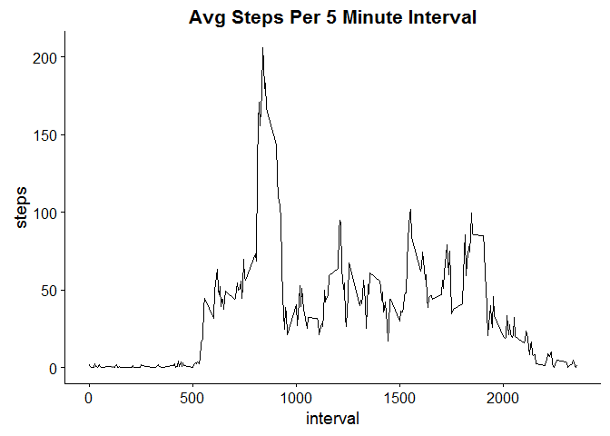
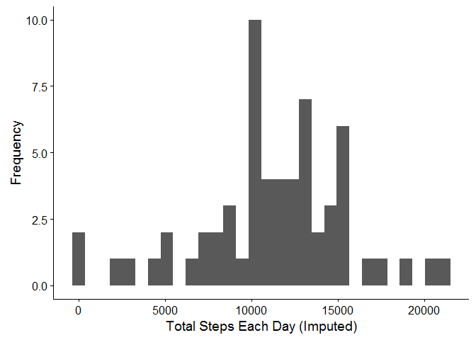
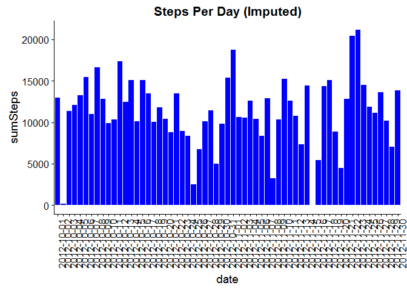
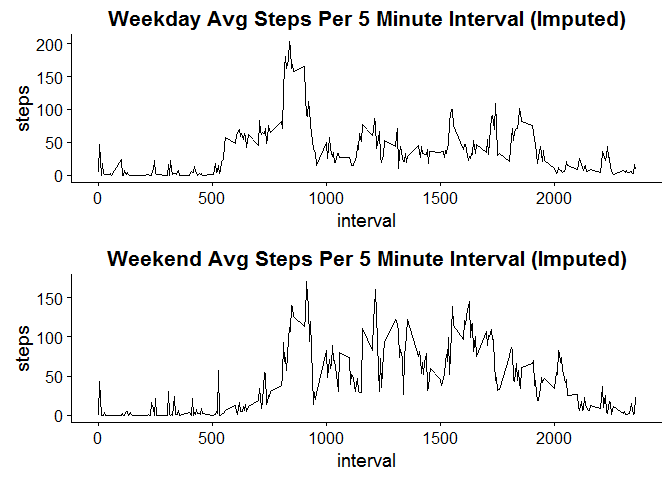

# Reproducible Research: Peer Assessment 1
#Set up R environment
Set working directory and load requried packages.

```r
#setwd("C:/Users/Hadrien/Dropbox/Coursera Data Science/reproducibleResearch/assignment1/RepData_PeerAssessment1-master")
library(ggplot2)
```

```
## Warning: package 'ggplot2' was built under R version 3.2.3
```

```r
library(plyr)
```

```
## Warning: package 'plyr' was built under R version 3.2.3
```

```r
library(mice) #used to impute missing values
```

```
## Warning: package 'mice' was built under R version 3.2.4
```

```
## Loading required package: Rcpp
```

```
## Warning: package 'Rcpp' was built under R version 3.2.3
```

```
## mice 2.25 2015-11-09
```

```r
library(chron)
```

```
## Warning: package 'chron' was built under R version 3.2.3
```

```r
library(cowplot)#needed to graph multiple plots
```

```
## Warning: package 'cowplot' was built under R version 3.2.4
```

```
## 
## Attaching package: 'cowplot'
```

```
## The following object is masked from 'package:ggplot2':
## 
##     ggsave
```


## Loading and preprocessing the data
Save the CSV file to a data frame. Remove NAs. Summarize data set for later use.

```r
df <- read.csv('Data/activity.csv') #Load Data
df2 <- df[!is.na(df$steps), ] #remove NAs
df2_summarized <- ddply(df2, c("date"), summarize, sumSteps = sum(steps)) #summarize
```


## What is mean total number of steps taken per day?
Make a histogram of the total number of steps taken each day:

```r
hist <- qplot(df2_summarized$sumSteps,
      xlab='Total Steps Each Day',
      ylab='Frequency')

#save to figures folder
png('figures/totalStepsPerDay.png', width=1000)
hist
```

```
## `stat_bin()` using `bins = 30`. Pick better value with `binwidth`.
```

```r
dev.off()
```

```
## png 
##   2
```

```r
#print plot
hist
```

```
## `stat_bin()` using `bins = 30`. Pick better value with `binwidth`.
```


Plot total number of steps per date (out of curiousity, not part of assignment)

```r
#plot results
ggplot(data=df2_summarized, mapping = aes(x=date, y=sumSteps)) +
  geom_bar(stat="identity", fill = 'blue') +
  theme(axis.text.x = element_text(angle = 90)) + #rotate x axis labels
  ggtitle('Steps Per Day') +
  theme(plot.title = element_text(face='bold', size=16))
```



```r
#Calculate mean & median
mean <- mean(df2_summarized$sumSteps, na.rm = TRUE)
median <- median(df2_summarized$sumSteps, na.rm = TRUE)
```
The mean number of steps is 1.0766189\times 10^{4} and the median is 10765.


## What is the average daily activity pattern?

```r
timeSeries<- ggplot(data=df2, aes(interval, steps)) +
  stat_summary(fun.y = mean, geom = 'line') +
  ggtitle('Avg Steps Per 5 Minute Interval') +
  theme(plot.title = element_text(face='bold', size=16)) 

#save to figures folder
png('figures/activityPattern.png', width=1000)
timeSeries
```

```
## Warning: Computation failed in `stat_summary()`:
## 'what' must be a character string or a function
```

```r
dev.off()
```

```
## png 
##   2
```

```r
#print plot
timeSeries
```

```
## Warning: Computation failed in `stat_summary()`:
## 'what' must be a character string or a function
```



```r
avg_steps_by_interval <- ddply(df2, c("interval"), summarize, avgSteps = sum(steps)) #summarize

#Print busiest time
busiestInterval <- (avg_steps_by_interval$interval[avg_steps_by_interval$avgSteps == max(avg_steps_by_interval$avgSteps, na.rm = T)])
```


## Imputing missing values

```r
sum(is.na(df$steps)) #calculate sum of NAs
```

```
## [1] 2304
```

```r
tempData <- mice(df, seed = 500) #impute missing values
```

```
## 
##  iter imp variable
##   1   1  steps
##   1   2  steps
##   1   3  steps
##   1   4  steps
##   1   5  steps
##   2   1  steps
##   2   2  steps
##   2   3  steps
##   2   4  steps
##   2   5  steps
##   3   1  steps
##   3   2  steps
##   3   3  steps
##   3   4  steps
##   3   5  steps
##   4   1  steps
##   4   2  steps
##   4   3  steps
##   4   4  steps
##   4   5  steps
##   5   1  steps
##   5   2  steps
##   5   3  steps
##   5   4  steps
##   5   5  steps
```

```r
df3 <- complete(tempData, 1)
df3_summarized <- ddply(df3, c("date"), summarize, sumSteps = sum(steps)) #summarize

#Plot new data set
bar_plot <- ggplot(data=df3_summarized, mapping = aes(x=date, y=sumSteps)) +
  geom_bar(stat="identity", fill = 'blue') +
  theme(axis.text.x = element_text(angle = 90)) + #rotate x axis labels
  ggtitle('Steps Per Day (Imputed)') +
  theme(plot.title = element_text(face='bold', size=16))

#Print plot
bar_plot
```



```r
#Save plot to figures folder
png('figures/totalStepsPerDayImputed.png', width=1000)
bar_plot
dev.off()
```

```
## png 
##   2
```

```r
ggplot(data=df3, aes(interval, steps)) +
  stat_summary(fun.y = mean, geom = 'line') +
  ggtitle('Avg Steps Per 5 Minute Interval (Imputed)') +
  theme(plot.title = element_text(face='bold', size=16)) 
```

```
## Warning: Computation failed in `stat_summary()`:
## 'what' must be a character string or a function
```



```r
#Calculate mean & median
mean(df3_summarized$sumSteps, na.rm = TRUE)
```

```
## [1] 10911.26
```

```r
median(df3_summarized$sumSteps, na.rm = TRUE)
```

```
## [1] 11042
```


## Are there differences in activity patterns between weekdays and weekends?

```r
df3$weekend <- is.weekend(df3$date)
for (i in 1:nrow(df3)) {

  if (df3$weekend[i] == TRUE) {
    df3$dayType[i] <- 'weekend'
  } else {
    df3$dayType[i] <- 'weekday'
  }
}

plot_weekend <- ggplot(data=subset(df3, dayType == 'weekend'), aes(interval, steps)) +
  stat_summary(fun.y = mean, geom = 'line') +
  ggtitle('Weekend Avg Steps Per 5 Minute Interval (Imputed)') +
  theme(plot.title = element_text(face='bold', size=16)) 

plot_weekday <- ggplot(data=subset(df3, dayType == 'weekday'), aes(interval, steps)) +
  stat_summary(fun.y = mean, geom = 'line') +
  ggtitle('Weekday Avg Steps Per 5 Minute Interval (Imputed)') +
  theme(plot.title = element_text(face='bold', size=16)) 

#Save plot to figures folder
png('figures/final_figure.png')
plot_grid(plot_weekday, plot_weekend, ncol = 1, nrow=2)
```

```
## Warning: Computation failed in `stat_summary()`:
## 'what' must be a character string or a function

## Warning: Computation failed in `stat_summary()`:
## 'what' must be a character string or a function
```

```r
dev.off()
```

```
## png 
##   2
```

```r
#Print plot
plot_grid(plot_weekday, plot_weekend, ncol = 1, nrow=2)
```

```
## Warning: Computation failed in `stat_summary()`:
## 'what' must be a character string or a function

## Warning: Computation failed in `stat_summary()`:
## 'what' must be a character string or a function
```




